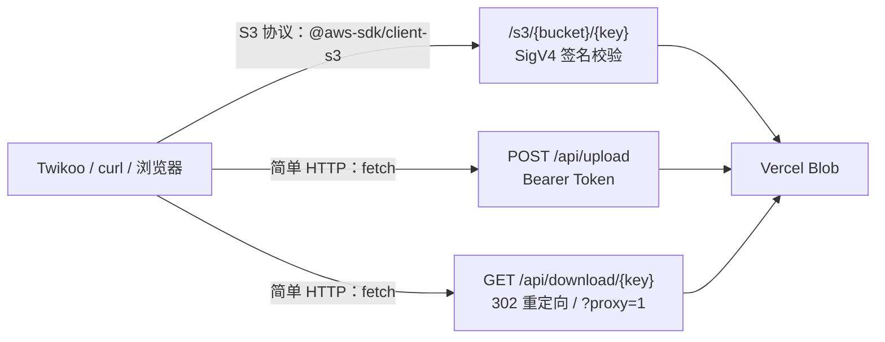

::timeline
{背景}

博客评论系统 Twikoo 的图片上传依赖第三方图床，近期服务稳定性无法保证。

{尝试}

考虑迁移至 Cloudflare R2，因支付方式绑定受限而搁置。

{结果}

转向 Vercel Blob，并为其构建了一层 S3 兼容网关。
::

## 问题的由来

本站评论区由 [Twikoo](https://twikoo.js.org/) 驱动，其图片上传通过 `imgUploader` 回调实现，存储需要自行对接图床。此前一直使用 sm.ms，近期该服务可靠性明显下降：已上传的图片在数日后出现失效，且无明确公告。免费第三方图床的可持续性本就存疑，迁移势在必行。

候选方案的评估结果如下：

| 方案 | 问题 |
| --- | --- |
| Cloudflare R2 | 需要绑定支付方式，本人验证无法通过 |
| 直接使用 Vercel Blob SDK | 仅支持服务端调用，浏览器端无法直接使用 |
| AWS S3 | 成本与账户管理开销与需求不匹配（因本人特殊原因无法使用） |
| 自建图床 | 运维成本过高 |

排除以上选项后，Vercel Blob 成为最合适的存储后端：开通即用，免费额度为 1GB 存储与每月 10GB 带宽，与本站评论区的图片量级完全匹配；且博客本身部署于 Vercel，存储与计算处于同一生态。

但它存在一个关键障碍：**Vercel Blob 的 API 与 S3 不兼容**——既不支持 S3 的 XML 协议，也不支持 SigV4 签名认证，官方 SDK 又只能在服务端运行。而 Twikoo 的上传行为发生在浏览器端，存储能力无法直接接入。

解决思路有二：编写一个专用的上传转发接口，或者将 Blob 完整封装为 S3 兼容服务。后者具备更普遍的复用价值，于是实现了本项目——它后来改名为 **blob-s3-imgbed**，并迁到了独立仓库：

::link-card
---
title: Krits03/blob-s3-imgbed
description: 把 Vercel Blob 包装成 S3 兼容 + 简单 HTTP 双接口的对象存储网关
icon: https://github.com/favicon.ico
link: https://github.com/Krits03/blob-s3-imgbed
class: gradient-card active
---
::

::card-list
- **S3 兼容接口**：支持 `PUT` / `GET` / `HEAD` / `DELETE`，自带 AWS SigV4 签名校验，Twikoo 的「S3 / R2 / MinIO」插件可直接对接
- **简单 HTTP 接口**：`POST /api/upload`（Bearer Token）+ `GET /api/download/{key}`（302 重定向 / 流式代理），无需任何 SDK
- **内置上传页面**：访问根路径即可拖拽上传图片，一键复制绑定域名后的回调 URL
- **零数据库**：Bucket 仅作逻辑前缀，对象真实存放在 Vercel Blob
- **签名安全**：AccessKey / SecretKey 自定义，用 `timingSafeEqual` 常量时间比较；上传 Token 同样常量时间校验
- **支持 Range**：下载接口支持断点续传 / 视频拖拽
::

## 设计与实现

项目在 Vercel Blob 之上构建网关层，对外同时提供两套接口，共享同一个 Blob Store 后端：

- **S3 兼容接口**：路径形如 `/s3/{bucket}/{key}`，支持 PUT、GET、HEAD、DELETE 四类对象操作，认证采用标准 SigV4 签名校验。任何使用 `@aws-sdk/client-s3` 或 AWS CLI 的调用方均可零改动接入。网关本身没有 bucket 实体，`bucket` 仅作为路径前缀用于逻辑分组，对象实际存储于 Blob 中 `{bucket}/{key}` 对应的位置。
- **简单 HTTP 接口**：上传为携带 Bearer Token 的 `fetch` POST 请求；下载默认以 302 重定向至 Blob CDN 地址，附加 `?proxy=1` 参数则切换为流式代理，隐藏源地址并支持 Range 请求。

完整请求链路如下：



技术栈：Next.js 15 App Router（Route Handler）+ `@vercel/blob` SDK + `node:crypto`。SigV4 校验是自己写的一套 HMAC 计算，没有引入 AWS SDK；签名比较使用 `timingSafeEqual`，避免时序侧信道。

::folding{title="仓库目录结构"}

```
.
├── app/
│   ├── layout.tsx                      # 根布局（metadata / html 骨架）
│   ├── page.tsx                        # 网页上传页（拖拽上传 + 复制 URL）
│   ├── s3/[...key]/route.ts            # S3 兼容接口（PUT/GET/HEAD/DELETE + SigV4）
│   └── api/
│       ├── upload/route.ts             # 简单上传接口（raw body / multipart）
│       └── download/[...key]/route.ts  # 简单下载接口（302 / 流式代理）
├── lib/
│   └── sigv4.ts                        # AWS SigV4 签名校验实现
├── .env.example                        # 环境变量模板
├── DEPLOY.md                           # 详细部署文档
├── TWIKOO_S3_CONFIG.md                 # Twikoo 管理面板 S3 插件配置指南
└── next.config.mjs
```
::

## 部署到 Vercel

新版把 Next.js 应用挪到了**仓库根目录**，Import 仓库后 Root Directory 保持默认即可，不需要再填 `vercel` 之类的子目录，Framework Preset 会自动识别为 Next.js。

1. 打开 [Vercel Dashboard](https://vercel.com/new) → **Import** 该仓库
2. 在 **Settings → Environment Variables** 里填入下面的变量
3. 点击 **Deploy**

不想点面板也可以用 CLI：

```sh
npm install -g vercel   # 如未安装
vercel                  # 首次部署（preview 环境）
vercel --prod           # 部署到生产环境
```

本地开发则是 `npm install` → 复制 `.env.example` 为 `.env.local` → `npm run dev`。

### 环境变量

| 变量名 | 必填 | 说明 |
| --- | :-: | --- |
| `BLOB_READ_WRITE_TOKEN` | 是 | Vercel Blob 读写令牌。Blob Store 绑到同一项目时会自动注入，跨项目需手动填写 |
| `S3_ACCESS_KEY` | 是 | S3 签名校验用 AccessKey，自定义值（如 `twikoo-blob`） |
| `S3_SECRET_KEY` | 是 | S3 签名校验用 SecretKey，强随机字符串 |
| `UPLOAD_TOKEN` | 是 | 简单上传接口（`/api/upload`）的 Bearer Token，强随机字符串 |

密钥建议用强随机值：`openssl rand -hex 32`{lang="sh" copy}

::alert{type="warning" title="本地开发要手动填 BLOB_READ_WRITE_TOKEN"}
Vercel 不会把 Blob 令牌注入本地环境，`npm run dev` 之前需要自己复制一份：Vercel Dashboard → Storage → Blob Store → **Copy Blob Read Write Token**。
::

## 接口参考

::tab{:tabs='["S3 兼容接口","简单 HTTP 接口","网页上传"]'}
#tab1
需要 SigV4 签名，任何 S3 客户端都能零改动接入：

| 方法 | 路径 | 说明 |
| --- | --- | --- |
| `PUT` | `/s3/{bucket}/{key}` | 上传对象 |
| `GET` | `/s3/{bucket}/{key}` | 下载对象（支持 `Range`） |
| `HEAD` | `/s3/{bucket}/{key}` | 获取对象元信息 |
| `DELETE` | `/s3/{bucket}/{key}` | 删除对象（幂等） |

用 AWS CLI 试一下最直观：

```sh
aws configure   # region 填 auto，AccessKey/SecretKey 用 S3_ACCESS_KEY / S3_SECRET_KEY

aws s3 cp test.jpg --endpoint-url https://<你的域名>/s3 s3://comments/test.jpg
aws s3 cp --endpoint-url https://<你的域名>/s3 s3://comments/test.jpg downloaded.jpg
```

#tab2
带 Bearer Token 即可，无需任何 SDK：

| 方法 | 路径 | 说明 |
| --- | --- | --- |
| `POST` | `/api/upload?name={filename}&path={prefix}` | raw body 上传，需 `Authorization: Bearer <UPLOAD_TOKEN>` |
| `POST` | `/api/upload?path={prefix}` | multipart/form-data 上传（字段 `file`） |
| `GET` | `/api/download/{key}` | 302 重定向到 Blob CDN |
| `GET` | `/api/download/{key}?proxy=1` | 流式代理返回内容（支持 `Range`） |

`/api/upload` 也支持用 query 传 token：`?token=<UPLOAD_TOKEN>`。

```sh
# 上传
curl -X POST "https://<你的域名>/api/upload?name=test.jpg&path=test" \
  -H "Authorization: Bearer <UPLOAD_TOKEN>" \
  -H "Content-Type: image/jpeg" \
  --data-binary @test.jpg
# → { "url": "...", "key": "test/20260924/1758...-test.jpg", "contentType": "image/jpeg", "size": 10240 }
```

#tab3
直接访问站点根路径就是内置的上传页，拖拽图片即可上传，传完能一键复制绑定域名后的回调 URL —— 偶尔传几张图时不用写任何脚本。
::

## 接入 Twikoo

::alert{type="info" title="推荐用管理面板的 S3 插件"}
Twikoo 的「S3 / R2 / MinIO」插件把配置存在服务端，密钥不会进入浏览器；前端 `imgUploader` 则必须把 `UPLOAD_TOKEN` 写进页面，只适合自用或内部场景。
::

| 方式 | 适用场景 | 说明 |
| --- | --- | --- |
| **S3 插件**（推荐） | 管理面板可视化配置 | 密钥保存在 Twikoo 服务端，不暴露给浏览器，详见仓库的 `TWIKOO_S3_CONFIG.md` |
| 前端 `imgUploader` | 自定义前端上传 | 在博客页面里用 `fetch` 调 `/api/upload`，`UPLOAD_TOKEN` 会暴露在前端 |
| 网页手动上传 | 偶尔上传几张图 | 直接访问站点根路径拖拽上传 |

S3 插件里最关键的几项：

| 配置项 | 值 |
| --- | --- |
| `S3_ENDPOINT` | `https://<你的域名>/s3` |
| `S3_FORCE_PATH_STYLE` | `true` |
| `S3_CDN_URL` | `https://<你的域名>/api/download`，**不含 bucket**（填错会导致上传成功但图片不显示） |
| `S3_REGION` | `us-east-1`（任意值均可） |

::folding{title="备选：前端 imgUploader 的写法"}

前端的 `imgUploader` 回调长这样，好处是页面里不用引入 S3 SDK：

```js [twikoo.init]
twikoo.init({
  envId: '<你的 envId>',
  imgUploader: {
    async upload(file) {
      const res = await fetch(
        'https://<网关域名>/api/upload?name='
        + encodeURIComponent(file.name) + '&path=comments',
        {
          method: 'POST',
          headers: {
            'Authorization': 'Bearer <UPLOAD_TOKEN>',
            'Content-Type': file.type,
          },
          body: file,
        }
      );
      const data = await res.json();
      return { url: data.url };
    },
  },
});
```

代价是 `UPLOAD_TOKEN` 会出现在客户端代码里，无法回避；缓解因素是 Vercel Blob 的公开 URL 不可枚举、读取无需权限，整体风险可控。要求更高的场景应把上传逻辑移到服务端，网关仅对内开放。
::

## 限制与费用

::quote{icon="tabler:brand-vercel"}
以下要点整理自 [Vercel Blob Pricing](https://vercel.com/docs/vercel-blob/usage-and-pricing)（官方页面更新于 2026-09-23）。Blob 按区域定价，官方也可能调整，请以文档页面为准。
::

### Hobby（免费版）额度

| 资源 | 免费额度 | 超出后 |
| --- | --- | --- |
| Blob 存储容量 | 1 GB / 月 | **无法继续使用 Blob**，需等待 30 天额度重置或升级 Pro |
| Simple Operations | 前 10,000 次 | 同上 |
| Advanced Operations | 前 2,000 次 | 同上 |
| Blob Data Transfer | 前 10 GB | 同上 |

超限不会自动扣费，只会收到提醒邮件并暂停 Blob 功能。Edge Requests、Fast Origin Transfer 按标准 CDN 费率另计，且免费额度在项目内所有 Vercel 服务间共享。

### 本项目会消耗哪些额度

| 操作 | 计费项 |
| --- | --- |
| `PUT /s3/{bucket}/{key}`、`POST /api/upload` | 1 次 **Advanced Operation**（服务端接收上传还会产生 Fast Data Transfer） |
| `HEAD` / `GET` / `DELETE /s3/...` | 内部调用 `head()`，各计 1 次 **Simple Operation** |
| `DELETE` 的 `del()` 本身 | **免费**，但计入速率限制 |
| 浏览器加载 Blob 公开 URL（302 后的地址） | cache MISS 计 1 次 Simple Operation；无论 HIT/MISS，每次访问都计 1 次 Edge Request |
| `?proxy=1` 或 `/s3` GET 流式代理 | 额外的 Functions 侧数据传输费用 |

省额度的三条建议：

- 优先走 `/api/download/{key}` 的 **302 重定向**：浏览器直连 Blob CDN，Blob Data Transfer 平均比 Fast Data Transfer 便宜约 3 倍。
- 避免高频 `HEAD` 探测，每次都是 1 次 Simple Operation。
- :tip[把 Blob 当图片存档]{tip="而不是高流量站点的 CDN 主力"}。

::folding{title="Pro 版参考价与速率上限"}

以 `iad1` 区域为例：

| 资源 | 套餐内含 | 超出单价 |
| --- | --- | --- |
| 存储容量 | 5 GB | \$0.023 / GB-month |
| Simple Operations | 100,000 次 | \$0.40 / 百万次 |
| Advanced Operations | 10,000 次 | \$5.00 / 百万次 |
| Blob Data Transfer | 100 GB | \$0.05 / GB |
| Fast Origin Transfer | 100 GB | \$0.06 / GB |

请求速率上限：

| 限制 | Hobby | Pro | Enterprise |
| --- | --- | --- | --- |
| Simple Operations | 1,200 / 分钟（20/s） | 7,200 / 分钟（120/s） | 9,000 / 分钟（150/s） |
| Advanced Operations | 900 / 分钟（15/s） | 4,500 / 分钟（75/s） | 7,500 / 分钟（125/s） |
::

其余几条硬限制：

- **上传请求体上限约 4.5 MB**：上传要经 Vercel Function 中转，受 Serverless 请求体限制约束；更大文件需改用 Blob 客户端直传。
- **单 Blob 缓存上限 512 MB**：超过后永不被 CDN 缓存，每次访问都会同时产生 Simple Operation 与 Fast Origin Transfer 费用。
- **单文件最大 5 TB**，官方建议超过 100 MB 用 multipart 上传。
- **区域固定**：Blob Store 可在 19 个区域创建，创建后不可更改，各区域价格不同。
- **控制台操作也计费**：在 Vercel Dashboard 浏览文件列表、上传文件、查看详情都会计入 Operations。
- **S3 接口只覆盖对象级操作**：不支持 ListObjects 等 bucket 级 API —— 网关没有真实的 bucket 概念。
- 上传关闭了 `addRandomSuffix`，文件名依赖时间戳区分，理论上存在冲突可能。

## 常见问题

::folding{title="访问 /api/upload 返回 401？"}

`UPLOAD_TOKEN` 没配置，或请求头里的 `Authorization: Bearer <token>` 与环境变量不一致。
::

::folding{title="S3 客户端报 SignatureDoesNotMatch？"}

依次检查三件事：`S3_ACCESS_KEY` / `S3_SECRET_KEY` 是否与客户端一致；`endpoint` 是否为 `https://<域名>/s3`（**不要带尾部斜杠**）；是否设置了 `forcePathStyle: true`。
::

::folding{title="上传成功但图片不显示？"}

Twikoo 场景下通常是 `S3_CDN_URL` 留空或填错，应填 `https://<域名>/api/download`，**不含 bucket**。
::

::folding{title="能上传多大的文件？"}

约 4.5 MB —— 这是 Vercel Serverless Function 的请求体上限。更大的文件建议直接用 Vercel Blob 客户端的直传 API。
::

::folding{title="免费额度用完了会怎样？"}

Hobby 版含 1 GB 存储、1 万次 Simple Operations、2 千次 Advanced Operations、10 GB 流量；超限只会暂停 Blob 功能（不扣费），需等 30 天额度重置或升级 Pro。
::

## 结语

这次改动比上次发文时更多：项目从 `vercel-blob-to-s3` 改名为 **blob-s3-imgbed** 并迁到独立仓库，Next.js 应用从子目录上移到仓库根目录，Twikoo 的接入方式也从「前端 `imgUploader`」换成了推荐的「管理面板 S3 插件」——密钥终于不用写进页面里了。原先的 Cloudflare Workers 版本没有跟着迁过来，新仓库里只有 Vercel 实现。

仓库里现在有两份文档：`DEPLOY.md` 是从零部署到 Vercel 的完整步骤，`TWIKOO_S3_CONFIG.md` 是 S3 插件的字段说明与排错表，比这篇文章更细。如有类似需求——不限于 Twikoo，任何需要在浏览器端使用 Vercel Blob 的场景——欢迎使用或提交 issue。

本站评论图床已切换，欢迎在评论区验证。

这应该是开学前的最后一篇了awa.
之后我会出一篇详细部署文章，敬请期待.
